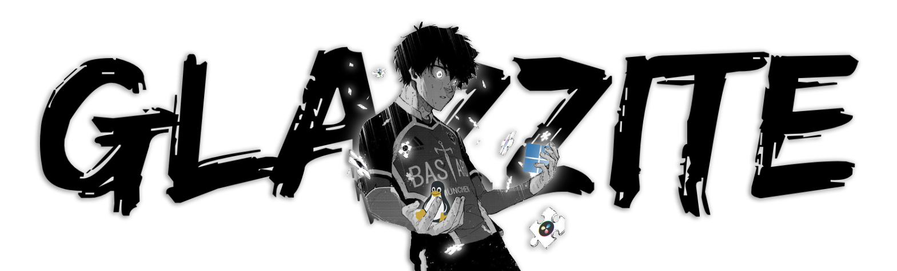

<h1 align="center">

**Shatter. Reborn. Rebel.**

</h1>

<h3 align ="center">

  im broke. 🤍
  
</h3>

─────

<h3 align ="center">

  Dev + Content Creator + Student + Freelancer
  
</h3>

    bare minimum btw 🥀

─────

<body>
  <h3 align="center">
    Name's Glaz. "Glazzite"
  </h3>
  

    I really shouldn't be here, but couldn't help myself.
  

</body>

─────

# a bit of me? 🤔

An idiot who tries to develop so many things that it starts developing his own fear in life. 

Anyways, I'm building my portfolio up, and as the above statement states, I kinda develop a few too many things in my life. So, it's not easy to pull up a '20 years of Experience' type portfolio when your not even 20 🥀.  Well who cares? Doing it for fun after all.

# skillset 🧪

### Windows
#### Experience :
- 4+ years of optimizing/modifiying
- almost know windows in-&-out

#### Projects :
##### Essence/Xenon
- my own custom windows iso (essence) & ame playbook (xenon)
- obtained 8gb windows install + 600MB RAM + 39 processes used idle on VM
- currently **not-in-development** due to legal risk

#### Preference :
- microslop sucks.
- preferred windows : win10 22H2 (debloated + optimized)

### Linux
#### Experience :
- Just Started. 2026. yeah.

#### Projects :
##### ams.sh - Absolute Minecraft Strap
- script that automatically sets up a Minecraft server using bash
- loader support (i.e vanilla, fabric, paper)
- multi-version support
- simple, light, one-time
- ams.sh v1.0 is publicly available.

#### Preference :
- preferred server distro : ubuntu server lts
- preferred usable distro : {tbd}
- preferred desktop enviro : kde plasma

    

<!--
**Glazzite/Glazzite** is a ✨ _special_ ✨ repository because its `README.md` (this file) appears on your GitHub profile.

Here are some ideas to get you started:

- 🔭 I’m currently working on ...
- 🌱 I’m currently learning ...
- 👯 I’m looking to collaborate on ...
- 🤔 I’m looking for help with ...
- 💬 Ask me about ...
- 📫 How to reach me: ...
- 😄 Pronouns: ...
- ⚡ Fun fact: ...
-->
